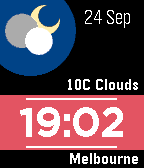
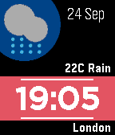
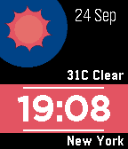
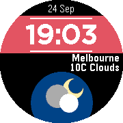
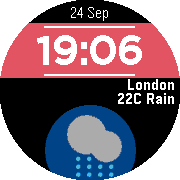
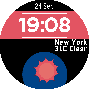

# Weathers Time

<h2>A Pebble Time and Pebble Time Round watchface</h2>

Features
- simple, clean and easy to read display
- date and time always displayed
- customisable background and text colors
- battery level display
- location based weather info
- temperature unit display preference
- date display preferece
- animation option
- bluetooth connection alert
- supports pebble time and pebble time round series
- supports language locale settings
  **language settings set based on watch language settings on pebble mobile app


<h2>Sample Screenshots:</h2>

<b>Pebble Time</b>





<b>Pebble Time Round</b>





<h2>Getting Started</h2>
1. cd into working directory
2. install pebble clay using the command ```$ pebble package install pebble-clay```
3. build using the command ```$ pebble build```

Weather data powered by:
<ul>
<li><a href="http://openweathermap.org/">OpenWeatherMap</a></li>
<li><a href="https://www.wunderground.com/">Weather Underground</a></li>
<li><a href="https://darksky.net/">Dark Sky</a></li>
<li><a href="https://www.yahoo.com/news/weather">Yahoo! Weather</a></li>
</ul>

Note: required to insert your own API keys at ```src/pkjs/index.js line 32, 125 and 319```

<b>Enjoy!</b>
